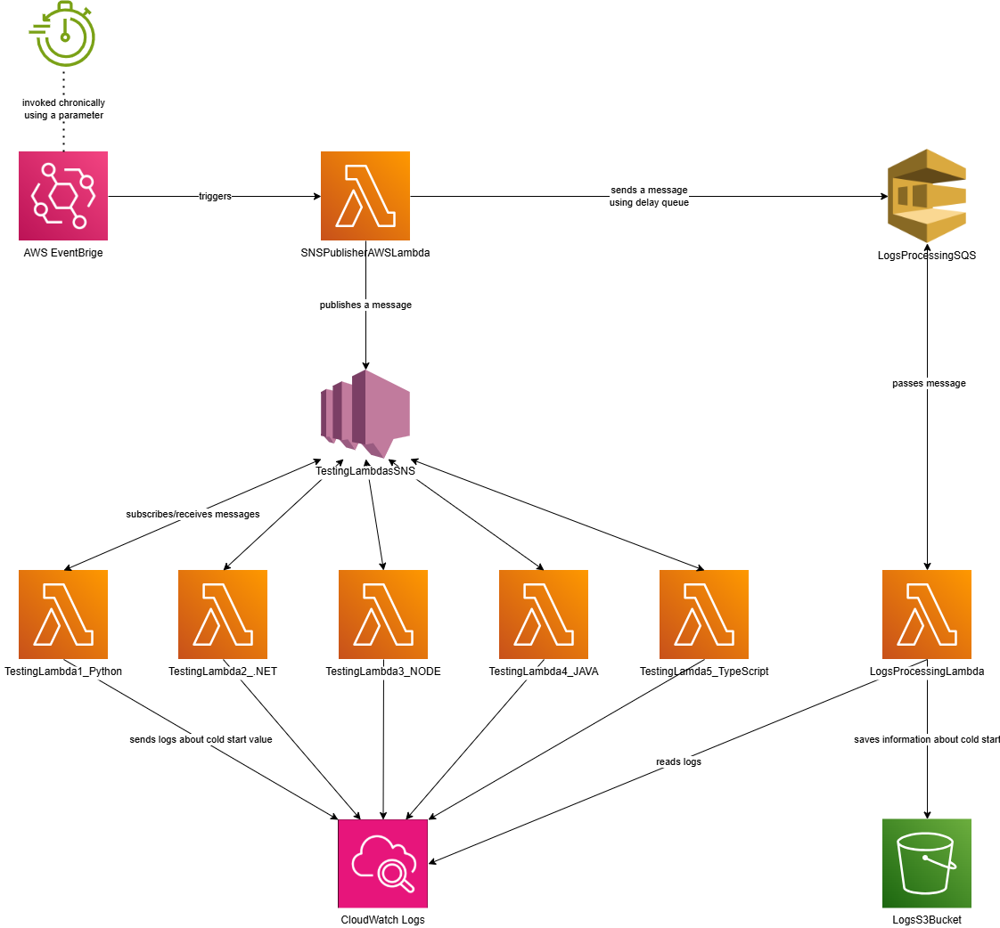

<h1> Praca magisterska </h1>
<h2> Wpływ środowiska uruchomieniowego na czas cold startu w AWS Lambda i Google Cloud Functions: analiza porównawcza i strategie minimalizacji. </h2>

 Celem pracy jest analiza wpływu środowiska uruchomieniowego na czas zimnego startu (cold start) w usługach AWS Lambda i Google Cloud Functions oraz opracowanie strategii jego minimalizacji. Cold startem nazywa się czas inicjalizacji funkcji i stanowi on kluczowy problem w modelu serverless, wpływający na wydajność i koszt działania aplikacji w chmurze.
W pracy zostaną porównane różne środowiska uruchomieniowe (np. Node.js, Python, .NET) pod kątem ich wpływu na czas inicjalizacji funkcji.
   
Analiza obejmie oficjalne środowiska dostarczane przez dostawców chmurowych.  
Kluczowe zadania pracy to:  
-Implementacja testowych funkcji w AWS Lambda i Google Cloud Functions dla różnych środowisk.  
-Pomiar i analiza czasów zimnego startu z wyszczególnieniem analizy porównawczej dla różnych dostawców chmurowych.  
-Identyfikacja czynników wpływających na opóźnienia.  
-Próby minimalizacji czasu cold start poprzez manipulację pozostałymi właściwościami funkcji i środowiska chmurowego.  
-Opracowanie i ocena strategii minimalizacji.  

Wnioski z pracy mogą pomóc w optymalizacji aplikacji serverless i wyborze optymalnych technologii dla konkretnych zastosowań. 

 

 W celu automatycznego przeprowadzania eksperymentów w ramach pracy utworzone zostało środowisko chmurowe o następującej architekturze: 

